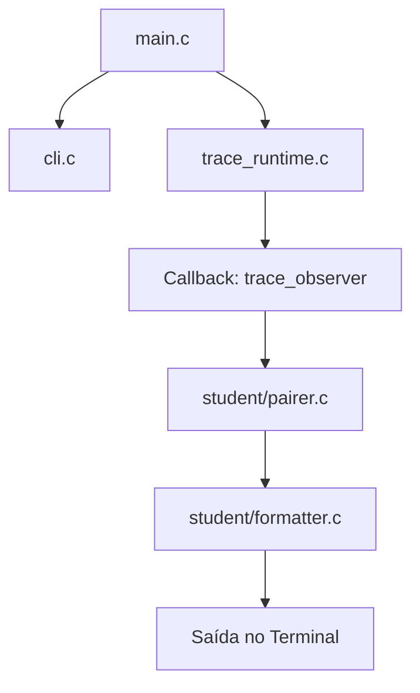

# Toytrace

`toytrace` é um projeto didático de Sistemas Operacionais. O objetivo é construir um pequeno monitor de chamadas de sistema (system calls) em Linux x86_64, fortemente inspirado no clássico `strace`, mas com escopo reduzido e simplificado para aprendizado.

O projeto intercepta e exibe no terminal as chamadas de sistema feitas por um processo filho, detalhando seus argumentos de entrada e seus respectivos códigos de retorno.

---

##  Arquitetura e Fluxo de Execução

O `toytrace` é estruturado em duas camadas principais: o **Runtime de Baixo Nível** (que interage diretamente com as APIs do Kernel Linux via `ptrace`) e o **Espaço do Estudante** (responsável pelo tratamento lógico, pareamento e formatação amigável das informações obtidas).



### O Fluxo de um Evento
1. **Pausa no Kernel:** O Kernel do Linux congela o processo filho (*tracee*) na entrada e na saída de qualquer chamada de sistema.
2. **Captura no Runtime:** O runtime do monitor (*tracer*) intercepta o congelamento, lê os registradores da CPU do filho e preenche uma estrutura portável `struct syscall_event`.
3. **Disparo do Callback:** O runtime chama a função observadora `trace_observer` em `main.c`.
4. **Pareamento (Pairing):** Como o processo para duas vezes por syscall (entrada e saída), a lógica em `pairer.c` retém o evento de entrada até que o evento de saída correspondente ocorra, unindo os parâmetros iniciais ao valor de retorno.
5. **Formatação (Formatting):** Com a chamada de sistema pareada e concluída, o formatador em `formatter.c` transforma os dados em texto estruturado e legível.
6. **Exibição:** O resultado formatado é impresso na saída padrão.

---

##  Estrutura do Projeto

*   **`src/main.c`**: Ponto de entrada que gerencia a inicialização, o parser de CLI e a ponte entre o runtime do `ptrace` e a lógica de processamento dos eventos.
*   **`src/cli.c`**: Processamento dos argumentos de linha de comando.
*   **`src/trace_runtime.c`**: O núcleo de tracing de processos. Gerencia o ciclo de vida do filho via `fork`, `execvp`, e as interrupções de depuração via `ptrace`.
*   **`src/trace_helpers.c`**: Auxiliares para ler memória de processos filhos, necessário para decodificar ponteiros de strings no espaço de memória virtual do filho (como caminhos de arquivos).
*   **`src/syscall_names.c`**: Mapeamento que converte códigos numéricos das syscalls para seus nomes textuais correspondentes.
*   **`include/`**: Arquivos de cabeçalho (`.h`) contendo definições de structs como `struct syscall_event` e interfaces de APIs.
*   **`src/student/`**:
    *   `pairer.c`: Lógica de associação entre entrada e saída de syscalls.
    *   `formatter.c`: Formatação final em strings textuais legíveis para apresentação ao usuário.

---

##  Compilação e Uso

### Compilar o projeto
Para gerar o binário `toytrace`, execute:
```bash
make
```

### Executar a monitoria (Modo Tradicional)
Para rastrear um programa alvo e visualizar suas chamadas de forma formatada:
```bash
./toytrace trace -- /bin/echo "Olá Mundo"
```

### Executar em modo cru (Raw Events)
Para imprimir diretamente as interrupções de entrada/saída cruas disparadas pelo `ptrace`:
```bash
./toytrace trace --raw-events -- ./tests/targets/hello_write
```

### Ver a ajuda da CLI
```bash
./toytrace --help
```

---

##  Testes

A suíte de testes valida a corretude das funções implementadas. Para rodar todos os testes automatizados, utilize:
```bash
make test
```


---

##  Especificações de Formatação das Syscalls

As seguintes syscalls devem ser interceptadas e impressas em formato específico e detalhado:

```text
read(fd, buf, count) = ret
write(fd, buf, count) = ret
openat(dirfd, "path", flags, mode) = ret
execve("path", ...) = ret
exit_group(status) = ret
```

Qualquer outra chamada não especificada acima pode ser exibida de forma genérica no formato:
```text
nome_da_syscall(arg0, arg1, arg2, arg3, arg4, arg5) = ret
```


> Para obter strings de parâmetros como os caminhos em `openat` e `execve`, utilize a função auxiliar disponível no runtime:
> ```c
> int read_child_string(pid_t pid, unsigned long addr, char *buf, size_t bufsz);
> ```
