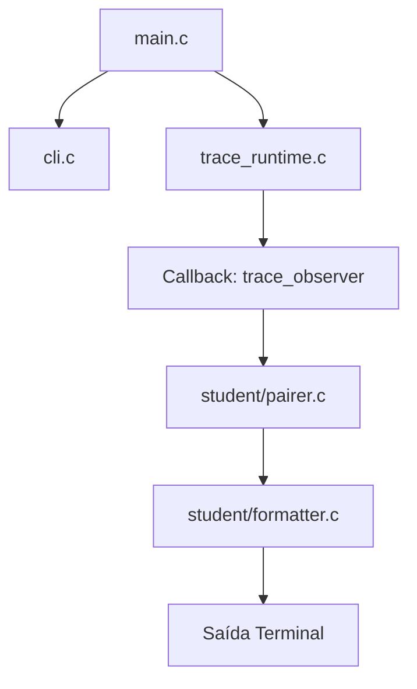

# Mapa do Código
Este documento descreve a arquitetura e o fluxo de execução do projeto `toytrace`.

## 1. Visão Geral da Arquitetura

O `toytrace` segue um modelo de camadas, onde o runtime de baixo nível (interação com o kernel) é separado da lógica de processamento e formatação de dados.

## 2. Componentes e Responsabilidades

## Onde o programa começa

O programa começa em `src/main.c`. É ali que a função `main()` chama `parse_args()` para processar os argumentos da linha de comando e depois chama `trace_program()` para iniciar o runtime de tracing.

## Onde o processo alvo é criado

O processo alvo deve ser criado em `src/trace_runtime.c`, dentro da função `launch_tracee()`. Essa função deve fazer `fork()`, e no filho executar `ptrace(PTRACE_TRACEME, ...)`, `raise(SIGSTOP)` e `execvp(argv[0], argv)`.

## Onde o runtime chama o callback

O runtime chama o callback na função `trace_program()` em `src/trace_runtime.c`. Depois de detectar uma parada de syscall, ele monta um `struct syscall_event` e, se `observer` não for NULL, chama `observer(&ev, userdata)`.

## Quais arquivos devemos modificar

Os arquivos principais a serem modificados são:

- `src/trace_runtime.c` — implementar `launch_tracee()`, `wait_for_initial_stop()`, `configure_trace_options()`, `resume_until_next_syscall()`, `wait_for_syscall_stop()`, e o preenchimento de `struct syscall_event` em `fill_event_from_regs()`.
- `src/student/pairer.c` — implementar o pareamento de eventos de entrada e saída de syscall --> Como o runtime para duas vezes por syscall (entrada e saída), este componente é responsável por guardar os dados da entrada para combiná-los com o resultado da saída.
- `src/student/formatter.c` — implementar a formatação legível das syscalls e os casos especiais --> Ele ransforma os dados brutos da syscall em uma string amigável para o usuário.

Devemos também deve entender `src/main.c`, `src/cli.c`, `include/cli.h`, `include/trace_runtime.h`, `include/syscall_event.h` e `src/trace_helpers.c` porque fazem parte do fluxo.

*   **`src/cli.c`**: Gerencia a linha de comando. Valida as opções e garante que o programa alvo seja informado corretamente após o separador `--`.
*   **`include/cli.h`**: Define as estruturas de opções usadas pelo parser.
*   **`src/trace_helpers.c`**: Funções utilitárias para ler dados da memória do processo filho (essencial para capturar strings como nomes de arquivos).
*   **`src/syscall_names.c`**: Um mapeamento que converte o número da syscall (ex: 1) em seu nome legível (ex: `write`).

## Qual TODO aparece primeiro ao executar o scaffold

O primeiro TODO aparece em `src/trace_runtime.c`, na função `launch_tracee()`. O scaffold imprime:

`erro: TODO Semana 2: implementar launch_tracee()`

## Qual é a principal dúvida técnica do grupo neste momento

A principal dúvida técnica é: como usar `ptrace` para avançar o filho até a próxima syscall e distinguir uma parada de syscall de outras paradas de sinal. Em outras palavras, nós precisamos entender o loop de trace: `PTRACE_SYSCALL`, `waitpid()`, `PTRACE_GETREGS`, e como usar `PTRACE_O_TRACESYSGOOD` para reconhecer quando o traceado parou por syscall.

## 3. Fluxo de um Evento

1.  O **Kernel** pausa o processo filho em uma syscall.
2.  O **Runtime** captura os registradores e preenche uma `struct syscall_event`.
3.  O **Runtime** chama a função `trace_observer` (em `main.c`).
4.  O **Observer** envia o evento para o **Pairer**.
5.  Quando o **Pairer** confirma que tem o par (entrada+saída) completo, o **Formatter** é acionado.
6.  O resultado final é impresso no terminal.